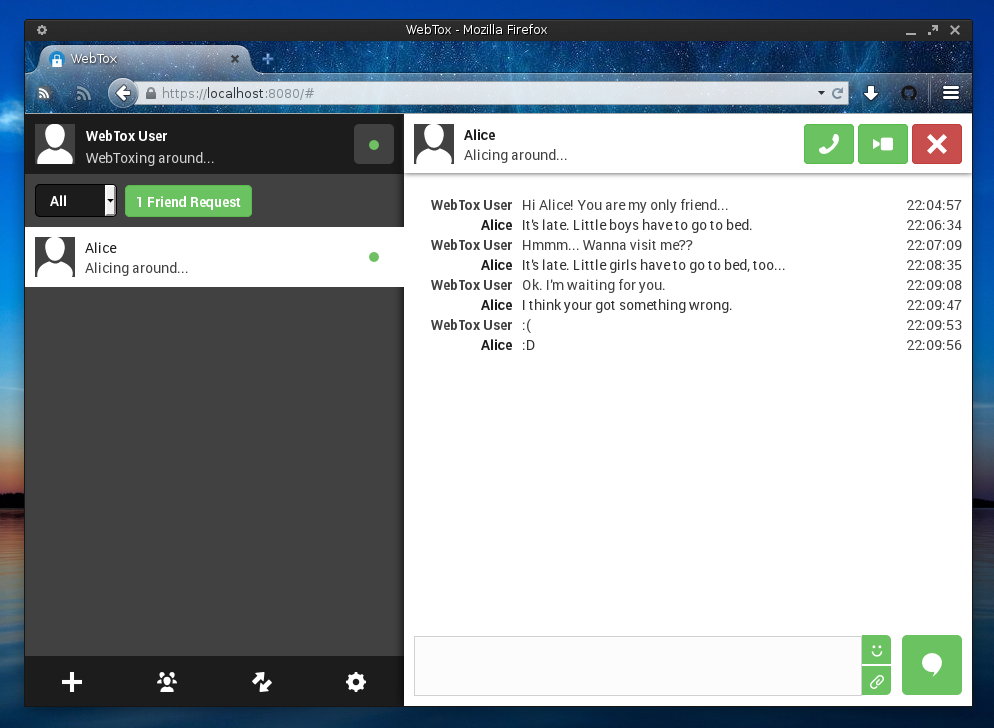

WebTox
======
WebTox is a web-based Tox client written in [go](https://golang.org/) (server-side) and html5 (client-side).

WebTox isn't ready yet! Please **don't use WebTox** if you don't know the risks of using unstable software.

When you should(n't) use WebTox
-------------------------------
You should use WebTox if
 - you would like to use Tox on any currently unsupported plattform that comes with support for web-based applications.
 - you are able to install it on your Raspberry Pi or any similar hardware.
 - you want to install it locally because you like web applications. ;)

You should **not** use WebTox if
 - you don't trust the server you would like to install it on.
 - you just want to use Tox as a normal desktop application and don't care about the technical details.
 - you have never heard of "Port Forwarding" and "DynDNS".

If WebTox does not fit your requirements, try out one of the [recommended Tox clients for your plattform](https://wiki.tox.chat/Binaries).

How to run
----------
If you are unfamiliar with Go, please start by reading [How to Write Go Code](http://golang.org/doc/code.html).

WebTox can be started simply by running `go run *.go` from within the `server` directory. Next, visit [http://localhost:8080/](http://localhost:8080/) and you are done.

Contributing
------------
Yay! Thanks. Any contribution is helpful. If you plan to start a huge change, it might be the best to create a Github Issue first.

License
-------
WebTox is released under the GNU General Public License v3.
